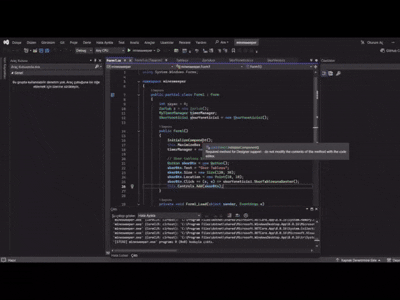
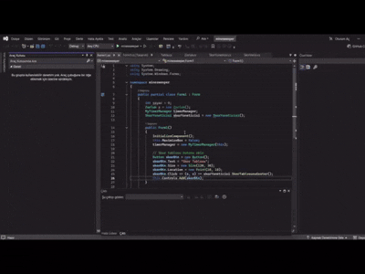

# Mayın Tarlası

Türkçe Windows Forms tabanlı klasik Mayın Tarlası oyunu. Modern C# ile geliştirilmiş, skor sistemi ve farklı zorluk seviyeleri içeren tam özellikli bir uygulama.

## Oynanış

## Zorluk Seçimi

## Özellikler

- 3 Zorluk Seviyesi: Kolay, Orta, Zor
- Skor Sistemi: Oyun süreleri JSON formatında kaydedilir
- Skor Tablosu: En iyi zamanlarınızı görüntüleyin
- Bayrak Sistemi: Sağ tık ile mayın işaretleme
- Zamanlayıcı: Oyun sürenizi takip edin
- Otomatik Alan Açma: Boş alanlar otomatik olarak açılır

## Zorluk Seviyeleri

| Seviye | Grid Boyutu | Mayın Sayısı | Buton Boyutu |
|--------|-------------|--------------|---------------|
| Kolay  | 8x9 (72)     | 10           | 120x90        |
| Orta   | 10x9 (90)    | 30           | 90x90         |
| Zor    | 15x9 (135)   | 50           | 60x90         |

## Nasıl Oynanır

- Oyuna Başlama: Zorluk seviyesini seçin
- Hücre Açma: Sol tık ile hücreleri açın
- Bayrak Koyma: Sağ tık ile mayın olduğunu düşündüğünüz yerleri işaretleyin
- Kazanma: Tüm mayın olmayan hücreleri açın
- Kaybetme: Mayına tıklarsanız oyun biter

## Kurulum ve Çalıştırma

### Gereksinimler

- .NET Framework 4.7.2 veya üzeri
- Windows işletim sistemi
- Visual Studio 2019 veya üzeri (geliştirme için)

## Proje Yapısı

minesweeper/  
├── Form1.cs              # Ana form ve uygulama başlangıcı  
├── Zorluk.cs             # Zorluk seviyesi seçimi  
├── Tahta.cs              # Oyun tahtası ve buton oluşturma  
├── Hucre.cs              # Oyun mantığı ve hücre işlemleri  
├── SkorYoneticisi.cs     # Skor kaydetme ve görüntüleme  
├── SkorVerisi.cs         # Skor veri modeli  
└── MyTimerManager.cs     # Zamanlayıcı yönetimi  

## Skor Sistemi

- Skorlar `skorlar.json` dosyasında saklanır
- Her skor şu bilgileri içerir:
  - Zorluk seviyesi
  - Tamamlama süresi (saniye)
  - Oyuncu adı
  - Oyun tarihi
- Skorlar zorluk seviyesine göre gruplandırılır ve süreye göre sıralanır

## Kullanılan Teknolojiler

- C# Windows Forms: Kullanıcı arayüzü
- System.Text.Json: JSON serileştirme
- FlowLayoutPanel: Dinamik buton yerleşimi
- Timer: Oyun süresi takibi

## Önemli Sınıflar

- **Hucre:** Oyun mantığının kalbi, mayın yerleştirme ve hücre açma işlemleri
- **SkorYoneticisi:** JSON tabanlı skor sistemi
- **Zorluk:** Zorluk seviyesi yönetimi
- **Tahta:** Oyun alanı oluşturma

## Bilinen Sorunlar

- Çok büyük grid boyutlarında performans sorunları olabilir
- Oyun bittiğinde uygulama tamamen kapanır (`Application.Exit()`)
